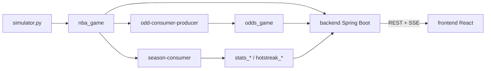

# Sistemas orientados a eventos — simulação NBA com Apache Kafka

Pipeline de eventos: produtor Python simula **temporada** (rodadas e partidas) e publica em `nba_game`; serviços Java processam com **Kafka Streams**; o **backend Spring Boot** consome Kafka e expõe dados via REST/SSE; o **frontend React** exibe o dashboard em tempo real.

## Requisitos

| Ferramenta | Versão mínima | Uso |
|------------|---------------|-----|
| Docker + Docker Compose | — | cluster Kafka (3 brokers KRaft) |
| JDK | 17+ | consumidores Java + backend |
| Apache Maven | 3.8+ | build Java |
| Python | 3.10+ | produtor/simulador |
| Node.js + npm | 18+ | frontend React |

Portas livres no host: **`19092`**, **`29092`**, **`39092`**, **`8080`**, **`5173`**.

---

## Arquitetura



| Componente | Tecnologia | Entrada | Saída |
|------------|------------|---------|--------|
| `producer/simulator.py` | Python + confluent-kafka | CSV NBA | `nba_game` |
| `OddConsumerProducer` | Kafka Streams (`odd-streams`) | `nba_game` | `odds_game` |
| `SeasonConsumerMain` | Kafka Streams (`season-stream-v4`) | `nba_game` | `stats_jogador`, `stats_time`, `hotstreak_player`, `simultaneous_streaks` |
| `NbaGameConsumer` | Kafka Consumer *(opcional)* | `nba_game` | placar no terminal |
| `backend/` | Spring Boot 3.3 | todos os tópicos | REST + SSE (`:8080`) |
| `frontend/` | React + Vite | API backend | dashboard web (`:5173`) |

Bootstrap Kafka para clientes no host: **`localhost:19092`**.

---

## Guia rápido — rodar tudo

### Passo 1 — Cluster Kafka

Na **raiz do repositório**:

```bash
docker compose up -d
docker compose ps
```

### Passo 2 — Criar tópicos

```bash
for TOPIC in nba_game odds_game hotstreak_player stats_time stats_jogador simultaneous_streaks; do
  docker exec kafka-1 /opt/kafka/bin/kafka-topics.sh \
    --create --if-not-exists \
    --topic "$TOPIC" \
    --partitions 3 \
    --replication-factor 3 \
    --bootstrap-server localhost:9092
done
```

### Passo 3 — Ambiente Python (produtor)

```bash
cd producer
python3 -m venv .venv
source .venv/bin/activate          # Windows: .venv\Scripts\activate
pip install -r requirements.txt
cd ..
```

O simulador lê **`data/list_nba_players.csv`**. **Execute sempre a partir da raiz do repo.**

### Passo 4 — Compilar módulos Java

O backend e os streams dependem do JAR `nba-consumer`:

```bash
cd consumer-java
mvn install -DskipTests
cd ..
```

### Passo 5 — Instalar dependências do frontend

```bash
cd frontend
npm install
cd ..
```

### Passo 6 — Subir os serviços (6 terminais)

Ordem recomendada: **streams → backend → frontend → simulador**.

| Terminal | Onde executar | Comando |
|----------|---------------|---------|
| **1** — odds | `consumer-java/` | `mvn -pl odd-consumer-producer exec:java` |
| **2** — season / stats | `consumer-java/` | `mvn -pl season-consumer exec:java` |
| **3** — backend | `backend/` | `mvn spring-boot:run` |
| **4** — frontend | `frontend/` | `npm run dev` |
| **5** — simulador | **raiz do repo** | `./producer/run_simulator.sh` |
| **6** — terminal *(opcional)* | `consumer-java/` | `mvn -pl nba-consumer exec:java` |

**Simulador:** entre rodadas, digite **`play`** quando solicitado.

**Dashboard web:** abra **http://localhost:5173**

**API:** **http://localhost:8080/api/health** deve retornar `ok`

Alternativa ao script do produtor (raiz, com venv ativo):

```bash
python producer/simulator.py
```

### Passo 7 — Parar tudo

- Pare cada processo Java/Node/Python com **Ctrl+C**
- Pare o cluster:

```bash
docker compose down
```

Para apagar dados dos brokers:

```bash
docker compose down -v
```

---

## Tópicos Kafka

### `nba_game` (entrada principal)

| `tipo` no JSON | Descrição |
|----------------|-----------|
| `INICIO` | início de partida (elencos) |
| `EVENTO` | lance (ponto, falta, turnover, substituição) |
| `FINAL` | fim de partida (placar) |
| `RODADA_INICIO` | início da rodada |
| `SEASON_START` | início da temporada (`times`: lista de siglas dos times) |
| `RODADA_FIM` | fim da rodada |
| `SEASON_END` | fim da temporada |

### Tópicos derivados

| Tópico | Conteúdo |
|--------|----------|
| `odds_game` | snapshot de odds por partida |
| `stats_jogador` | pontos acumulados por jogador |
| `stats_time` | standings por time (`TeamStats`) |
| `hotstreak_player` | alerta de sequência de pontos (>2 pts em 5s) |
| `simultaneous_streaks` | contagem de hot streaks simultâneas |

---

## Backend (`backend/`)

Spring Boot 3.3 — consome Kafka e expõe JSON ao frontend.

```bash
cd backend
mvn spring-boot:run
```

Requer `mvn install` em `consumer-java/` antes (passo 4).

### Rotas da API

| Método | Rota | Descrição |
|--------|------|-----------|
| `GET` | `/api/health` | health check |
| `GET` | `/api/season` | temporada e rodada atual |
| `GET` | `/api/ranking` | classificação dos times |
| `GET` | `/api/leaders` | top 3 jogadores em pontos |
| `GET` | `/api/hot-streak` | jogadores em hot streak |
| `GET` | `/api/dashboard` | snapshot agregado |
| `GET` | `/api/live` | SSE — atualizações em tempo real |

O frontend usa **`/api/dashboard`** na carga inicial e **`/api/live`** (SSE) para atualizar ranking, líderes e hot streak sem recarregar a página.

---

## Frontend (`frontend/`)

React 18 + Vite + TypeScript.

```bash
cd frontend
npm run dev
```

Abre em **http://localhost:5173**. O Vite faz proxy de `/api` → `http://localhost:8080`.

**Seções do dashboard:**
- **Ranking** — classificação por pontos (3 pts por vitória), confronto ao vivo com odds
- **Líderes** — top 3 em média de pontos (total ÷ jogos disputados)
- **Hot Streak** — jogadores em sequência quente

O ranking é preenchido ao receber `SEASON_START` do simulador — apenas os times da temporada atual, em ordem aleatória com 0 pontos.

---

## Estrutura do repositório

```
.
├── docker-compose.yml          # cluster Kafka
├── data/list_nba_players.csv   # elenco NBA
├── producer/                   # simulador Python
├── consumer-java/
│   ├── nba-consumer/           # parser + modelo + terminal (opcional)
│   ├── odd-consumer-producer/  # Kafka Streams → odds
│   └── season-consumer/        # Kafka Streams → stats / hot streak
├── backend/                    # Spring Boot REST + SSE
└── frontend/                   # React dashboard
```

---

## Observações

- **`OddConsumerProducer`** e **`SeasonConsumerMain`** são apps Kafka Streams distintas; ambas leem `nba_game` sem conflitar.
- O **`backend`** usa `group.id=dashboard-api-grupo` e consome todos os tópicos.
- O **`season-consumer`** chama `cleanUp()` ao iniciar — zera state stores locais (útil em dev).
- O backend usa `auto-offset-reset: latest` — só processa mensagens **novas** após subir. Inicie o backend **antes** ou **junto** com o simulador.
- Reiniciar o backend zera o estado em memória do dashboard (Kafka mantém o histórico).
